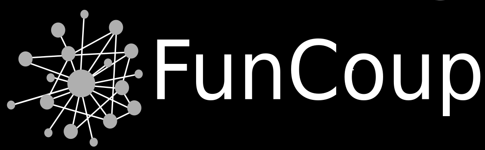

# FunCoup5 Network Analysis

This repository contains R analysis scripts for benchmarking biological functional association networks, with a focus on FunCoup5 and comparisons against resources such as STRING and HumanNet.

<p align="center">
  
</p>

## Scope

The code supports two related analyses:

- Random walk with restart benchmarking on pathway-based seed/test splits.
- Network property comparison across curated biological gene sets and networks.

## Repository Layout

```text
.
├── R/
│   ├── randomwalk.R
│   └── compare_network_properties.R
├── docs/
│   └── data.md
├── tools/
│   └── check-project.R
├── Figure.png
└── README.md
```

## Scripts

| Script | Purpose |
| --- | --- |
| `R/randomwalk.R` | Defines helpers for loading networks, creating KEGG-based pathway splits, running random walk with restart, and saving PR/ROC benchmark outputs. |
| `R/compare_network_properties.R` | Compares within-trait link recovery across FunCoup, STRING, and HumanNet using curated GWAS and mapping resources. |

## Dependencies

Core R packages:

- `dnet`
- `PRROC`
- `igraph`
- `biomaRt`
- `dplyr`
- `purrr`

Install missing packages before running the full analyses. Some packages are Bioconductor packages and should be installed through `BiocManager`.

## Data

Large networks, gold-standard files, GWAS resources, and gene-translation tables are not committed to this repository. Place them under a local `data/` folder or point the scripts to them with environment variables.

See [docs/data.md](docs/data.md) for the expected inputs.

## Quick Check

Run this from the repository root:

```bash
Rscript tools/check-project.R
```

This validates the repo structure and parses the R scripts. It does not download data or rerun the network benchmarks.

## Example

```r
source("R/randomwalk.R")

kegg <- read.delim("data/pathways/kegg.tsv")
splits <- create_splits(kegg, n = 30, seed = 1)
funcoup <- load_network("data/networks/funcoup.tsv")
benchmark_network(funcoup, kegg, splits, output_prefix = "results/funcoup")
```

## Contact

Miguel Castresana Aguirre  
[miguel.castresana.aguirre@ki.se](mailto:miguel.castresana.aguirre@ki.se)
